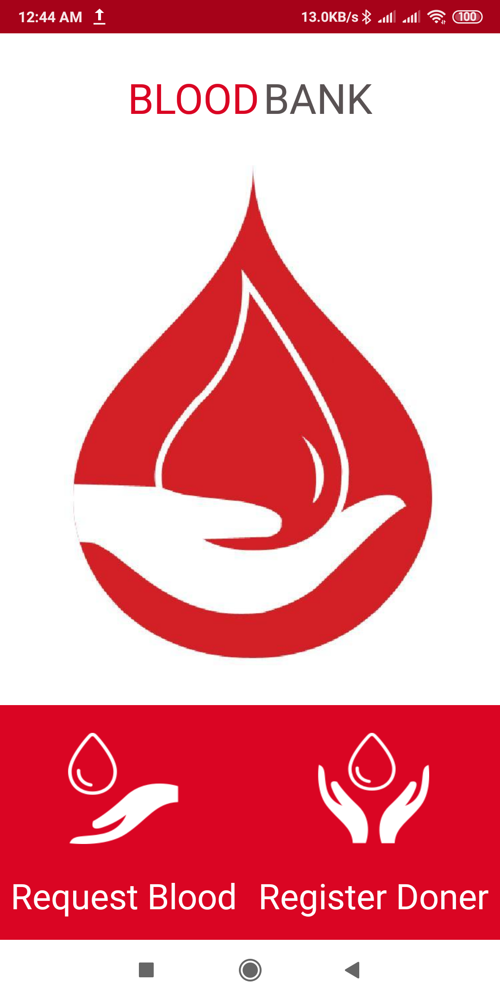
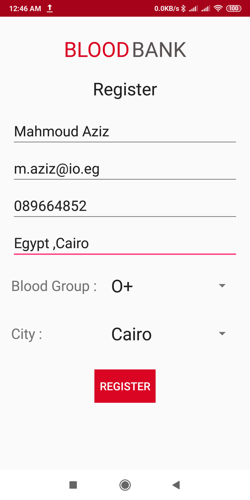
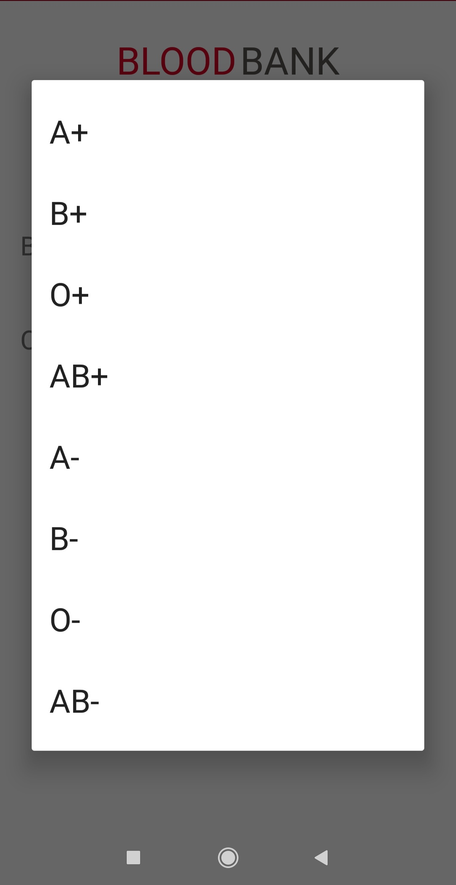
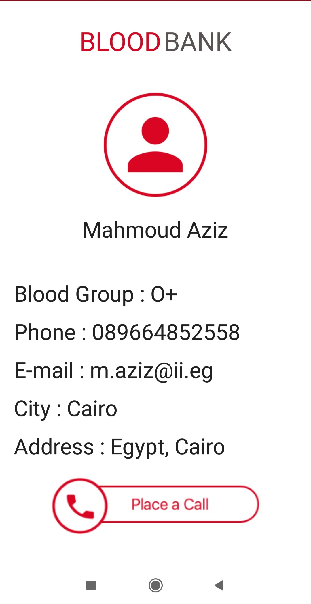
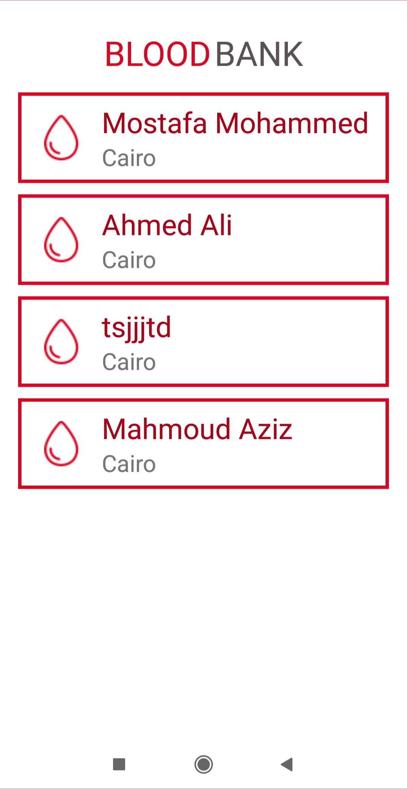

# BloodBank
This app help users to find doner of particular Blood Group and it could filter results based on location. The doners can register themselves and provide their contact details. 

Android Goodies
==================
<ul>
<li>Sqlite Database</li>
<li>Make a Phone call using ACTION_CALL</li>
<li>RunTime Permision.</li>
<li>ArrayAdapter.</li>
<li>Dealing with fragments</li>
</ul>

    
